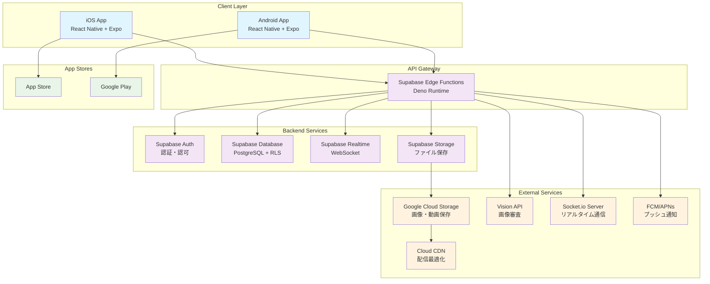

# マッチングアプリ アーキテクチャ設計書（個人開発向け）

## 技術スタック
- **フロントエンド**: React Native + Expo
- **バックエンド**: Supabase Edge Functions + Node.js
- **データベース**: Supabase PostgreSQL
- **認証**: Supabase Auth
- **インフラ**: Supabase + Google Cloud Storage + Cloud CDN
- **その他**: Socket.io (リアルタイム通信) + Vision API (画像審査)

## システム構成図

## 選択理由

- **React Native + Expo**: 個人開発に最適。一つのコードベースでiOS/Android対応、豊富なライブラリとExpoの簡単なビルド・デプロイ機能
- **Supabase**: Firebase代替のオープンソースBaaS。PostgreSQL、認証、リアルタイム、ストレージを統合提供。個人開発者に優しい料金体系
- **Supabase PostgreSQL**: 高機能なリレーショナルDB。Row Level Security（RLS）でセキュアなマルチテナント設計が可能
- **Supabase Auth**: JWT認証、OAuth対応、メール認証など必要な認証機能を簡単に実装。追加コストなし
- **Google Cloud Storage + Cloud CDN**: 画像・動画の大容量ストレージとCDN配信。従量課金で小規模時は低コスト。Firebase統合でSupabaseとも連携しやすい
- **Vision API**: 画像の自動審査（不適切コンテンツ検出、SafeSearch）。人手での審査コストを大幅削減。高精度な日本語対応
- **Socket.io**: リアルタイムチャット機能。WebSocketベースで安定した双方向通信

## 初期コスト（Initial）
- **Apple Developer Program**: $99
- **Google Play Developer**: $25
- **ドメイン取得**: $15
- **SSL証明書**: $0 (Let's Encrypt)
- **開発ツール**: $0 (オープンソース)
- **合計**: $139

## ランニングコスト

### Phase 1 (MVP - ~100ユーザー)
- **Supabase Pro**: $25/月
- **Google Cloud Storage**: $3/月 (50GB想定)
- **Cloud CDN**: $2/月
- **Vision API**: $8/月 (1000画像/月想定)
- **Socket.io Server (Railway)**: $5/月
- **ドメイン**: $1/月
- **合計**: $44/月 ($528/年)

### Phase 2 (成長期 - ~1000ユーザー)
- **Supabase Pro**: $25/月
- **Google Cloud Storage**: $12/月 (200GB想定)
- **Cloud CDN**: $8/月
- **Vision API**: $40/月 (5000画像/月想定)
- **Socket.io Server (Railway Pro)**: $20/月
- **プッシュ通知 (FCM/APNs)**: $0 (無料枠内)
- **ドメイン**: $1/月
- **合計**: $106/月 ($1,272/年)

### Phase 3 (スケール期 - 1000ユーザー超)
- **Supabase Team**: $599/月
- **Google Cloud Storage**: $30/月 (500GB想定)
- **Cloud CDN**: $25/月
- **Vision API**: $120/月 (15000画像/月想定)
- **Socket.io Server (専用)**: $50/月
- **外部年齢確認サービス**: $100/月
- **ドメイン**: $1/月
- **合計**: $925/月 ($11,100/年)

## アーキテクチャの特徴

### 🎯 個人開発最適化
- **ワンストップ開発**: Supabaseで認証・DB・API・リアルタイムを統合管理
- **ノーコード/ローコード**: 管理画面、分析ダッシュボードが標準装備
- **簡単デプロイ**: Expo EAS Buildで自動ビルド・ストア申請

### 💰 コスト効率
- **従量課金**: 利用量に応じた料金体系で初期は低コスト
- **無料枠活用**: 多くのサービスで無料枠を最大限活用
- **運用自動化**: 手動運用を最小限に抑制

### 🔒 セキュリティ
- **RLS（Row Level Security）**: データベースレベルでのアクセス制御
- **JWT認証**: ステートレスで安全な認証システム
- **HTTPS/WSS**: 全通信の暗号化

### 📈 スケーラビリティ
- **段階的成長**: ユーザー数に応じてプラン変更で対応
- **マネージドサービス**: インフラ管理の負担を最小化
- **マイクロサービス化**: 必要に応じて機能を分離可能

## リスク軽減策

### 技術的リスク
- **Vendor Lock-in対策**: Supabaseはオープンソースのため、必要時に自前環境への移行が可能
- **障害対応**: マネージドサービスの冗長化とバックアップ体制
- **パフォーマンス**: CDN活用と適切なインデックス設計

### 運用リスク
- **法的対応**: 利用規約の厳格化と段階的なコンテンツモデレーション
- **コスト管理**: アラート設定と定期的な利用量監視
- **セキュリティ**: 定期的なアクセス権限見直しと脆弱性対応

この設計により、個人開発でも安全で拡張性のあるマッチングアプリを低コストで構築・運用することが可能です。特にGCPの採用により、画像処理の精度向上と若干のコスト削減を実現しています。